***
GLOSSAIRE RESEAU
***

***
Qu'est-ce qu'une pile de protocoles ?
***

    - C'est un ensemble de règles et de procédures de communication utilisées de part et d'autres par toutes les stations qui échangent des données sur le réseau.
    - Il existe de nombreux protocoles réseau, mais il n'ont ni le même rôle, ni la même façon de procéder.
    - Certains protocoles fonctionnent sur plusieurs couches du modèle OSI, d'autres correspondent à une seule couche de ce modèle
    - Des piles de protocoles différentes peuvent coexister sur une même station.
    - Un réseau qui comporte plusieurs segment doit utiliser un protocle routable.

*** 
Qu'est-ce qu'un protocole (ou couche) ? 
***

    - Un protocole a une fonction bien précise dans le processus de transmission des données.
      - Chaque couche correspond à la réalisation d'une ou plusieurs tâche :
      - Une tâche est réalisé par un seul protocole
      - Toutes les tâches d'une couche OSI sont réalisées par un seul protocole
      - Plusieurs tâches de différentes couches OSI sont réalisées par un seul protocole
      - Toutes les tâches de plusieurs couches OSI sont réalisées par un seul protocole
    - Le nombres de protocoles constituant une pile n'est pas obligatoirement égal au nombre de couches du modèle OSI
      - La pile de protocole comporte des couches hautes et basses
      - Les couches basses spécifient la manière dont les matériels sont connectés
      - Les couches hautes énonces les règles de communication.
      - Les opérations de couches hautes sont plus complexe que celles des couches basses.

*** 
Qu'est-ce qu'un modèle OSI ? 
***

    - OSI = Open Systems Interconnection
    - C'est un cadre conceptuel qui définit comment les systèmes réseau communiquent et envoient des données d'un expéditeur à un destinataire.
    - Il est utilisé pour décrire chaque composant de la communication de données pour pouvoir établir des règles et des normes pour les applications et l'infrastructure du réseau
    - Il contient 7 couches qui s'empile de bas en haut, qui sont les suivantes :
        - PHYSIQUE -> émission des paquets sur le réseau sous la forme d'un flot de bits brut
        - LIAISON DES DONNEES -> ajoute des informations de contrôle d'erreurs d'un paquet
        - RESEAU -> ajoute un numéro d'ordre et des informations d'adressage au paquet
        - TRANSPORT -> ajoute des infos pour le traitement des erreurs des paquets
        - SESSION -> ajoute des infos de flux pour indiquer le départ d'un paquet
        - PRESENTATION -> ajoute des infos de formatage, d'affichage, de chiffrement
        - APPLICATION -> initie ou accepte une requête réseau

***
Qu'est-ce que le protocole IP (Internet Protocol) (faisant partie de la couche réseau)
***

    - C'est un ensemble de règles pour l'adressage et le routage des données sur internet
    - Il peut être utilisé avec plusieurs protocles de transport (notamment TCP / UDP)
    
    - Son rôle ? :
        - C'est un des protocoles les plus importants d'internet, car :
            - il permet l'élaboration et le transport des paquets de données

***
Qu'est-ce qu'une addresse IP ?
***

    - C'est une sorte de code qui permet l'identification de chaque terminal connecté au réseau internet.
    - Un terminal = un objet connecté. Cela peut-être :
        - un ordinateur
        - un serveur
        - un smartphone
        - une console de jeux
        - une imprimante
    etc...
    - Cela permet d'ienditifer chaque appareil et de les distinguer les uns des autres.
    - Plusieurs appareils peuvent partager une une même adresse ip, ex :
        - Si les appareils sont connectés à une box, ils partagent l'adresse ip de celle-ci
    - Elle se présente sous la forme : 183.10.262.1

***
Qu'est-ce qu'un masque de sous-réseau ?
***

    - C'est un nombre de 32 bits se présentant sous la forme de 1 et de 0
    - Il s'écrit de la même manière qu'une adresse IP
    - Il divise également une adresse ip en deux parties, créant 2 composants différents d'un réseau
    - Ils sont nécessaire pour accéder à Internet via le protocole TCP/IP
    - Les 24 premiers bits sont l'adresse réseau
    - Les 8 derniers bits sont l'adresse de l'hôte

***
Qu'est-ce que l'adressage ?
***

    - Cela permet d'identifier les positions d'une mémoire ou les unités d'un ordinateur par une adresse permettant l'accès direct à l'information traitée ou à traiter.

***
Qu'est-ce que le routage ?
***

    - Est le processus de sélection du chemin dans un réseau
    - Un réseau informatique est composé de nombreuses machines (appelées noeuds) et de chemins ou de liaisons qui relient ces machines
    - La communication entre deux machines d'un réseau peut s'effectuer par différentes chemins,
    - Le routage en lui-même sélectionne le meilleur chemin à l'aide de certaines règles prédéterminées

***
Qu'est-ce qu'un routeur ?
***

    - Il dirige et achemine les données du réseau à l'aide de paquets qui contiennent différents type de données
    - Les paquets de données comportent plusieurs couches, qui transportent chacune des informations d'identification
     Le routeur lit cette couche , hiérarchise les données et choisit le meilleur itinéraire à utiliser pour chaque transmission

***
Qu'est-ce qu'Internet ?
***

    - C'est un ensemble de réseaux mondiaux interconnectés
    - Permet à des ordinateurs et à des serveurs de communiquer au moyen d'un protocole de communication commun (IP).
    - Ses principaux services, sont :
        - le web
        - le ftp
        - la messagerie
        - les groupes de discussions

****
COMMANDES 
****

* ipconfig
* 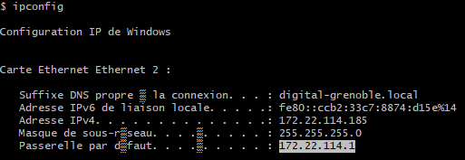
  * Permet d'avoir toutes les caractèristique de la machine sur laquelle on se trouve. 
  * Suffixe DNS propre à la connexion 
  * Adresse IPv6 : Même fonction que IPv4 sauf que les éléments sont plus agrégés.
  * Adresse IPv4 : Adresse ip de la machine utilisée sur le réseau ou elle se trouve
  * Masque de sous-réseau : Comparer les nombres demandés pour savoir sur quel réseau on se trouve
  * Passerelle par défaut : Sert a pouvoir remonter sur le réseau du dessus.

* 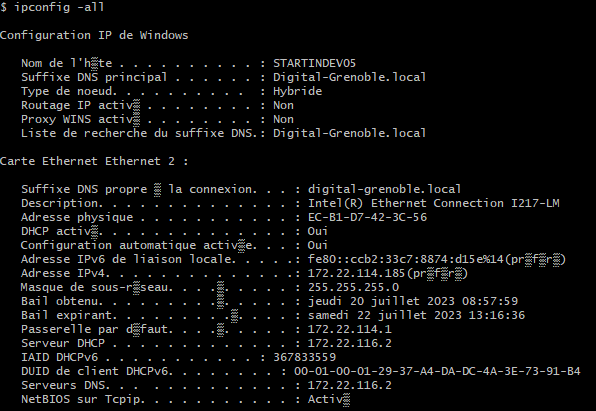
  * Permet d'avoir toutes les caractéristiques des connexions réseaux (adresse IP, adresse MAC...) 

* Savoir si une machine est accesible ou non :
  * ping <IP_DE_LA_MACHINE_CIBLE>
    * ex : ping 172.22.144.1 (ping de la passerelle) (machine accessible)
      * 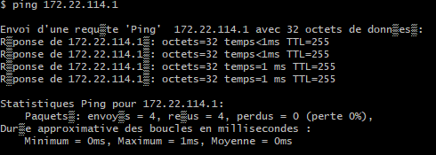
    * ex : ping 172.22.114.119 (ping de la machine de maher) (machine non accessible)
      * 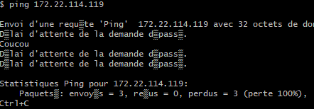
    * ex : ping 8.8.8.8 (service DNS Google répondant aux pings)
      * 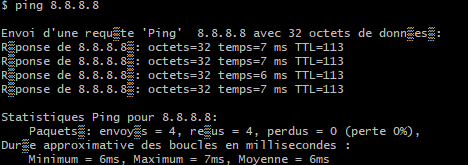
* Faire un ping persistant
  * ping -t <IP_DE_LA_MACHINE_CIBLE>
    * ex : ping -t ping 172.22.144.1 (passerelle)
      * 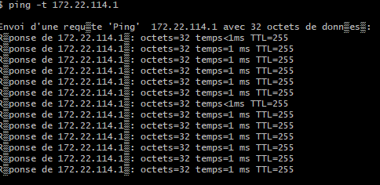
* Savoir le ou les chemins disponible pour accéder à la machine cible
  * tracert <IP_DE_LA_MACHINE_CIBLE>
    * ex : tracert 172.22.114.1 (passerelle)
      * 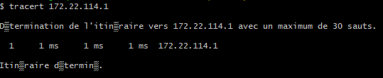
    * ex : tracert 172.22.114.119 (machine maher)
      * 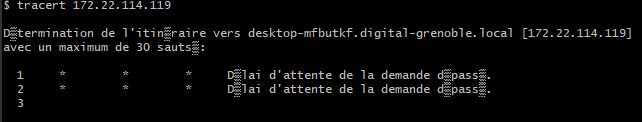
*  Pour déterminer le chemin le plus direct à la machine cible
  * pathping <IP_DE_LA_MACHINE>
    * ex : pathping 172.22.114.1 (passerelle)
      * 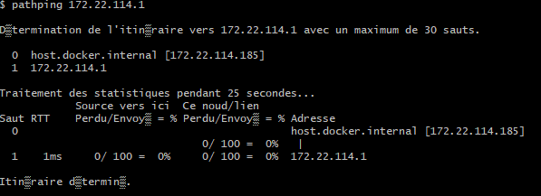
    * ex : pathping 172.22.114.119 (maher)
      * 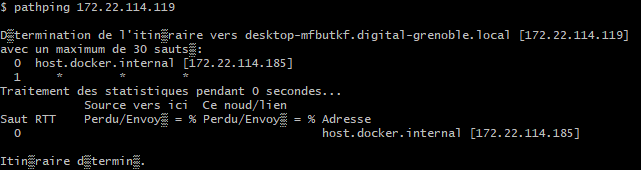
*  lister les routages entre les sous réseaux
  * route 
    * 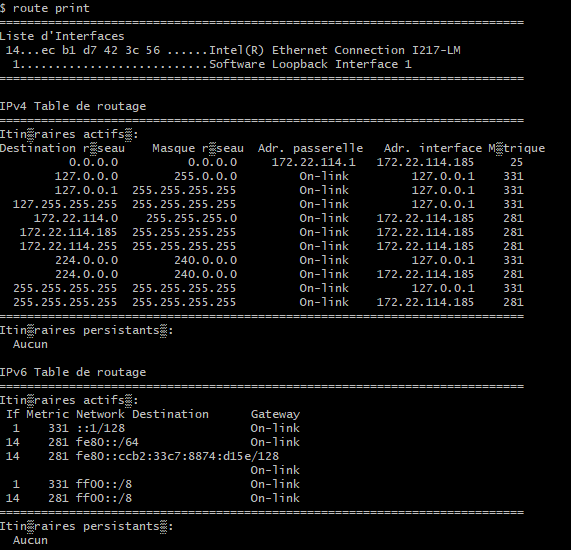
*  lister les connexions en cours sur la machine locale
  * netstat
    * 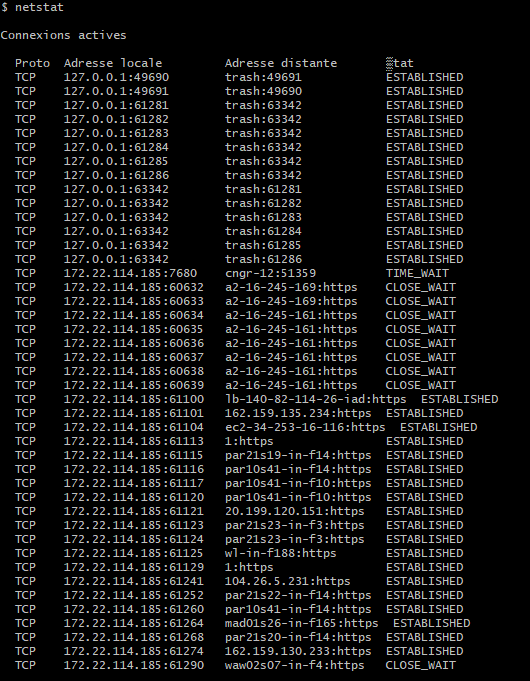
* Utilitaire de script en ligne de commande
  * Qui permet localement ou a distance, d'afficher ou de modifier la configuration réseau d'un ordinateur en cours d'exécution
  * Utilisé sans paramètres, netsh ouvre l'invite de commandes Netsh.exe (c-à-d netsh)
* Afficher et modifier les entrées dans le cache ARP (Address Resolution Protocol) 
  * affiche les table de cache ARP actuelles pour toutes interfaces
    * arp -a
      * 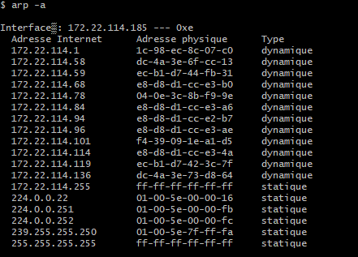